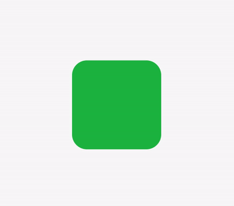

# SimpleAnimation

[](https://travis-ci.org/keithito/SimpleAnimation)
[](http://cocoapods.org/pods/SimpleAnimation)
[](http://cocoapods.org/pods/SimpleAnimation)
[](http://cocoapods.org/pods/SimpleAnimation)
[](https://github.com/Carthage/Carthage)


**SimpleAnimation is a UIView extension that makes adding basic animations, like fades and bounces, simple...**

```swift
view.bounceIn(from: .left)
```


**...with sensible defaults...**

```swift
view.popIn()
```


**...while remaining customizable**

```swift
view.shake(toward: .top, amount: 0.5, duration: 2, delay: 0.5)
```



## Installation

### CocoaPods

To integrate SimpleAnimation into a project using [CocoaPods](http://cocoapods.org), add the following to your `Podfile`:

```ruby
pod "SimpleAnimation"
```


### Carthage

To integrate SimpleAnimation into a project using [Carthage](https://github.com/Carthage/Carthage), add the following to your `Cartfile`:

```
github "keithito/SimpleAnimation"
```


### Older Xcode Versions

If you are using Xcode 8 to build your project, you need to use version **0.3.2** of SimpleAnimation.
You can do so by specifying the version number in your Podfile or Cartfile.


## Supported Animations

The following animations are supported so far:
  * fadeIn
  * fadeOut
  * fadeColor
  * slideIn
  * slideOut
  * bounceIn
  * bounceOut
  * popIn
  * popOut
  * hop
  * shake

Please see the [example ViewController](Example/Source/ViewController.swift) for more usage examples.
To build the example in XCode, open Example/Example.xcodeproj.


## License

SimpleAnimation is available under the MIT license. See the LICENSE file for more info.
